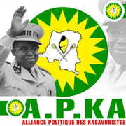

# A.P.KA - Alliance Politique des Kasavubistes



## 🇨🇩 À Propos

L'Alliance Politique des Kasavubistes (A.P.KA) est une plate forme politique aux idéaux Kasavubistes que prônait le premier président de notre pays, Héro national S.E Joseph Kasavubu.

### Notre Mission

Nous sommes des disciples idéologiques de Joseph Kasavubu, ce grand homme qui a défendu avec courage et sagesse l'intégrité territoriale de notre nation de manière pacifique. Notre mission est de promouvoir :

- **L'intérêt général** - Pour un Congo uni et fort avec une justice sociale équitable
- **L'intégrité** - Une conduite irréprochable et transparente dans nos actions politiques  
- **La bonne gouvernance** - Une gestion efficace et participative des affaires publiques

## 🌟 Nos Valeurs Fondamentales

- **Intérêt Général** : Continuons la lutte pour un Congo uni et fort
- **Intégrité** : Maintenir une conduite transparente et responsable
- **Bonne Gouvernance** : Promouvoir une gestion efficace et équitable

## 👨‍💼 Notre Leader

**Pierre Baseya Ndombe** - Président de l'APKA

> "Nous sommes des disciples idéologiques du feu Président Joseph Kasavubu. Il n'y a pas mieux que lui dans la défense de l'intégrité territoriale de manière pacifique."

## 🚀 Site Web en Direct

Visitez notre site web officiel : [A.P.KA Website](https://your-username.github.io/apka-website)

## 📁 Structure du Projet

```
APKA-WEB/
├── index.html              # Page d'accueil principale
├── blog.html              # Page du blog
├── article-rencontre-historique.html  # Article historique
├── styles.css             # Styles CSS
├── script.js              # JavaScript
├── images/                # Dossier des images
│   ├── logo.jpg
│   ├── joseph-kasavubu.jpg
│   ├── pierre-baseya-ndombe.jpg
│   └── ...
└── README.md              # Ce fichier
```

## 🛠️ Technologies Utilisées

- **HTML5** - Structure sémantique
- **CSS3** - Styles modernes et animations
- **JavaScript** - Interactivité et formulaires
- **Font Awesome** - Icônes
- **Google Fonts** - Typographie (Montserrat, Playfair Display)
- **EmailJS** - Gestion des formulaires de contact

## ✨ Fonctionnalités

- 📱 **Design Responsive** - Compatible tous appareils
- 🎨 **Interface Moderne** - Design élégant aux couleurs nationales
- 📝 **Formulaire d'Adhésion** - Rejoignez notre mouvement
- 💬 **Intégration WhatsApp** - Contact direct
- 📱 **Réseaux Sociaux** - Liens Facebook et YouTube
- ⚡ **Animations Fluides** - Expérience utilisateur optimale
- 🖼️ **Galerie Interactive** - Présentation visuelle

## 🚀 Déploiement avec GitHub Pages

### Option 1: Déploiement Automatique

1. **Fork ou Clone** ce repository
2. Allez dans **Settings** > **Pages**
3. Sélectionnez **Deploy from a branch**
4. Choisissez **main branch** comme source
5. Votre site sera disponible à `https://[username].github.io/[repository-name]`

### Option 2: Déploiement Local

```bash
# Cloner le repository
git clone https://github.com/[username]/apka-website.git

# Naviguer vers le dossier
cd apka-website

# Ouvrir avec un serveur local (exemple avec Python)
python -m http.server 8000

# Ou avec Node.js
npx serve .
```

## 📞 Contact

- **Téléphone** : [+243830497332](https://wa.me/243830497332)
- **Email** : ngueyipaul@gmail.com
- **WhatsApp** : [Contactez-nous](https://wa.me/243830497332)
- **Facebook** : [Notre Page](https://www.facebook.com/share/1GfPiBwfsj/)
- **YouTube** : [Notre Chaîne](https://www.youtube.com/watch?v=0pFzmUU_GZ4)

## 🤝 Contribuer

Les contributions sont les bienvenues ! Pour contribuer :

1. **Fork** le projet
2. Créez une branche pour votre fonctionnalité (`git checkout -b feature/AmazingFeature`)
3. **Commit** vos changements (`git commit -m 'Add some AmazingFeature'`)
4. **Push** vers la branche (`git push origin feature/AmazingFeature`)
5. Ouvrez une **Pull Request**

## 📜 Licence

Ce projet est sous licence MIT. Voir le fichier [LICENSE](LICENSE) pour plus de détails.

## 🏛️ L'Héritage de Joseph Kasavubu

### Timeline Historique

- **1960** - Premier Président de la RDC après l'indépendance
- **Défense de l'Unité** - Préservation de l'intégrité territoriale
- **Leadership Pacifique** - Privilégiant le dialogue et la négociation
- **Héritage Durable** - Fondement de nos valeurs politiques actuelles

---

## 🙏 Remerciements

- À tous les militants de l'A.P.KA
- Aux développeurs qui ont contribué
- À la mémoire du Président Joseph Kasavubu
- Au peuple congolais pour son soutien

---

**© 2023 Alliance Politique des Kasavubistes (A.P.KA). Tous droits réservés.**

> *"L'honnêteté, l'intégrité et la bonne gouvernance"* - Notre devise